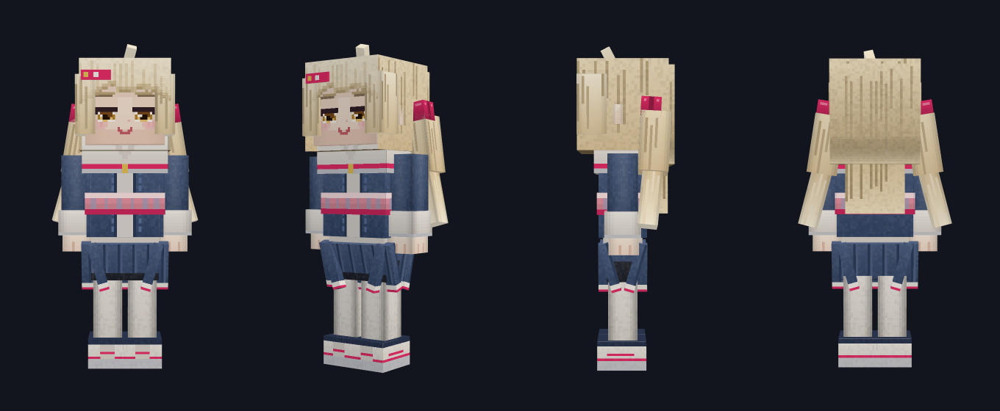
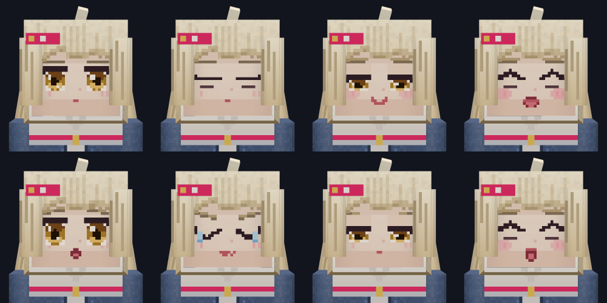

# Companions

A companion is an ordinary entity with three things turned on: the **Companion**
body, the **Companion** temperament, and a face. This page is about how each of
those works, and how to make one that is not Kohane.



---

## The body

`bodyPreset: 'companion'` is a thirty-one-unit character — a head above a
villager, level with a player. It is built in
`src/core/generators/bodies/companion.ts` from a *draft*: cubes with no UVs.

```ts
{ origin: [-3.5, 14, -2], size: [7, 8, 4], inflate: 0.45, paint: 'jacket' }
```

`packBody` shelf-packs every cube onto the sheet, tallest first, and hands back
ordinary geometry. Nothing is hand-placed, which is the only reason a body with
forty cubes stays maintainable: moving a cube never means re-deriving somebody
else's UV origin.

Two rules keep it honest:

- **Sizes stay integers.** A cube's patch is `2*(depth+width)` by
  `depth+height`; a fractional size lands the artwork between texels. Layering is
  done with fractional *origins* and `inflate`, which leave the UV grid alone.
- **Mirrored pairs share a patch.** `share: 'boot'` means the left and right boot
  are drawn from one rectangle, so they cannot end up subtly different.

The bones the animation generator looks for:

| Bone | What it gets |
|---|---|
| `head` | looks where the entity is looking |
| `body`, `neck` | a breathing sway |
| `arm_left` / `arm_right` | a walk swing, and a slight idle drift |
| `leg_left` / `leg_right` | the vanilla walk cycle, and a folded sitting pose |
| `skirt_front` / `_back` / `_left` / `_right` | a drift when still, a swing when walking |
| `tail_*` and `tail_*_tip` | hair that lags behind the head rather than moving with it |
| `wing_left` / `wing_right` | a flap, faster while flying |
| `crossbar` | a creak in the wind (that one is the scarecrow) |

Every clause is conditional on the bone existing, so a body gets the animation
that fits it without `entityAnim.ts` ever learning its name.

---

## The temperament

`temperament: 'companion'` splits the entity in two:

- **Untamed**, it panics, remembers who hurt it, and follows anyone holding one
  of its **Tamed with** items.
- **Tamed**, a component group is added by the taming event, carrying
  `follow_owner`, `sittable` + `stay_while_sitting`, `persistent`, the
  owner-defence goals and the feeding interaction.

That split is why the interesting half of the behaviour lives in
`component_groups` rather than `components`: it is exactly how a vanilla wolf is
built, and it means an untamed one behaves sensibly rather than following the
first player it sees.

| Field | Effect |
|---|---|
| Tamed with | `minecraft:tameable.tame_items`, and it is tempted by them too |
| Follows within | how far it may drift before it comes back |
| Sits when told | `minecraft:sittable`, plus the sitting pose from the body |
| Defends its owner | `owner_hurt_by_target`, `owner_hurt_target` and a melee goal |
| Healed by / Health per feed | a `minecraft:interact` that only its owner can use |
| Can be leashed | `minecraft:leashable` |

---

## The face



Eight zero-thickness planes sit in the same place in front of the head, each
tagged as a *variant*:

```ts
variant: { group: 'face', name: 'happy' }
```

`buildVariantSelectors` turns a variant group into two things:

1. One statement in the client entity's `scripts.pre_animation`, which is the
   only per-frame Molang hook a resource pack has:

   ```
   v.kohane_face = (q.hurt_time > 0) ? 5 : ((q.is_sitting) ? 6 : (...));
   ```

2. A `part_visibility` block on the render controller hiding every bone whose
   index does not match.

So the whole system runs on the client, in the renderer, and costs the server
nothing per tick. The rules, highest priority first:

| When | Face |
|---|---|
| just took damage | hurt |
| sitting down | sleepy |
| in the air | surprised |
| about every 4.6 seconds, briefly | blink |
| running | sing |
| walking | happy |
| idle, every so often | smile |
| otherwise | neutral |

They live in `FACE_RULES` in `src/core/generators/expressions.ts`. A body that
declares only some of those variants gets only the clauses that apply, and a
body with fewer than two variants in a group gets no selector at all.

Turn **Reacts with its face** off and the render controller goes back to being
three lines — worth doing if you have painted a single face onto the head cube
and do not want the planes at all.

---

## The artwork

The sheet is painted by code, in model units, against the body spec:

```ts
sock: ({ faces, sides }) => {
  sides((brush) => {
    brush.gradient(P.white, P.whiteDim)
    brush.roundX(0.09, -0.24)
    brush.box(0, 0, brush.width, 0.9, P.navyDark)   // over-the-knee band
  })
  faces.up.fill(P.black)
  faces.down.fill(P.whiteDim)
},
```

A recipe never sees a UV coordinate. It is handed one `Brush` per cube face,
already framed on the patch the packer chose, and draws in the same units the
geometry uses. That is what keeps the artwork attached to the model: move the
cube, and its paint follows.

```bash
node scripts/make-companion.mjs             # 512px sheet + spawn egg icon
node scripts/make-companion.mjs --scale 1   # 128px, vanilla resolution
node scripts/render-companion.mjs           # the pictures on this page
```

Both are deterministic — a re-run with no source change leaves the working tree
clean, so a texture only appears in a diff when the art actually changed.

### Why the sheet is bigger than the model

The geometry declares `texture_width: 128`, and the shipped PNG is 512px. Bedrock
normalises UVs by the *declared* size, so a sheet at a whole multiple of it drops
straight on with no UV changes and four times the detail. The pixel editor's UV
template and the 3D preview both work in model units, so they are unaffected.

### The spawn egg

`spawn_egg` is an optional texture slot on any entity that has one. Fill it and
the client entity gets `{ texture, texture_index }`; leave it empty and it falls
back to the two tint colours. `src/core/generators/skin/spawnEgg.ts` paints the
one Kohane ships with — an egg profile drawn row by row, so the silhouette stays
symmetric at any scale.

---

## Making your own

1. Copy `bodies/companion.ts`, change the cubes, keep the sizes integer.
2. Add it to `PRESETS` in `geometry.ts` and to `BODY_PRESET_OPTIONS`.
3. Either paint it — a recipe per `paint` key in a new file next to
   `companionSkin.ts` — or draw a sheet by hand against the UV template the
   pixel editor lays over the canvas.
4. Write a preset, and bind the artwork to the entity's texture slots:

```ts
assets: [
  {
    node: 'entity:yourcharacter',
    slot: 'main',
    fileName: 'yourcharacter.png',
    url: 'textures/companion/yourcharacter/skin.png',
    width: 512,
    height: 512,
  },
]
```

A preset's `url` has to be a path under `textures/`, served by the app itself.
A preset from the inbox is untrusted input, and one that could name any host it
liked would be fetching bytes off the internet the moment somebody pressed
**Apply**. Anything self-contained can inline `base64` instead.

---

## Kohane

The shipped preset is a character from Project SEKAI: COLORFUL STAGE! feat.
Hatsune Miku — © SEGA / Craft Egg Inc., developed by Colorful Palette, with
Crypton Future Media. She is here as fan work, and the pixel art in this
repository was drawn from scratch for the Minecraft body: no model, mesh or
texture from anywhere else is redistributed here.
